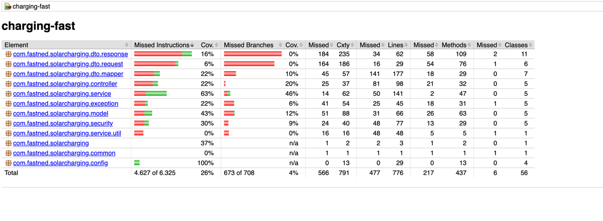
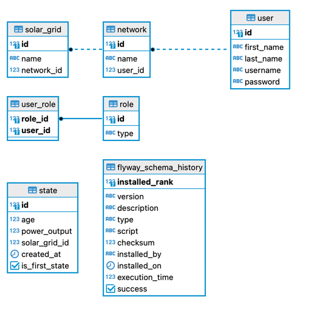

## Fast Charging

This is a REST API to stores and fetch data related to Solar Grids. These solar grids were designed to produce electrical energy from the sunlight. 

This API aims to offer ways to simulate how these solar grids produce energy, and the amount of energy produced.

### Description

- A User access the REST API directly (using Postman or Insomnia) or using the Frontend (ReactJS)
- A User can create Solar Grids. A set of Solar Grids are grouped into Networks
- In order to use the API, the User must be authenticated (JWT)
- A User can create Networks (list of Solar Grids) using endpoints to send a File or specifying a JSON in the HTTP Request Body

### Technical Solution

The solution is implemented in a layered structure, based on the MVC: `controllers` (where we implement REST API endpoints - they are the point of contact with the Users), 
`services` (which interfaces with the controllers on actions which implements high level requirements and coordinates actions among other services), repositories (which access the permanent storage),
The technologies used for the REST API were: Java 17, Spring Boot, Spring Framework, Spring Security, Spring Data JPA, Hibernate, PostgreSQL, etc.

For the Frontend the technology used were: React.JS, Node 16 and Material UI.

The database used was PostgreSQL 14.6.

All of these were delivered using containers orchestraded with docker compose.

All the API is described using OpenAPI (Swagger). Once you start up the Backend container, you can access the API spec using the link: http://localhost:8080/swagger-ui/index.html

### Testing

I used some different approachs for testing - Unit Testing, Mock testing and a kind of Integration Testing (using testcontainers). 

To generate the Jacoco reports you need to run the following:
```
mvn jacoco:report
```
To open the Jacoco reports, which are generated by the command above, go to: `$PATH/target/site/jacoco/index.html`

It is important to have tools like Jacoco or Sonar, to take care of the tests coverage and where to create more tests.

Example below:


It is possible to test it using Postman. There is an exported file with a Postman colletion to test the endpoints:

[fast_charging_api.postman_collection.json](fast_charging_api.postman_collection.json)

### Domain Model




### Getting Started

## How to run?

The application can be run in development or production mode by applying the following steps.
<br/>

### Prerequisites

The following apps should be installed before running the application:

- A command line app
- Docker Desktop

> **Note** <br/>
> For more information regarding the system requirements, etc. refer to the following pages: <br/>
> [Install on Mac](https://docs.docker.com/desktop/install/mac-install/)<br/>
> [Install on Windows](https://docs.docker.com/desktop/install/windows-install/)<br/>
> [Install on Linux](https://docs.docker.com/desktop/install/linux-install/)<br/>

<br/>

### Running the app - Fast charging Backend and Frontend

In order to run the application in development mode, apply the following steps:

1. Run Docker desktop.

<br/>

2. Open command prompt window and clone the project from GitHub using the following command:

```
git clone https://gitlab.com/fastned-recruitment/backend/19042023-rosfran-lins-borges.git
```
<br/>

3. Change the current directory to the project directory where the `docker-compose.yml` file is in:

```
cd fast-charging
```
<br/>

4. Run the following command:

You can use:

```
docker-compose  up --build
```
Or in some Docker installations:
```
docker compose  up --build
```

<br/>

Then the Frontend application written in React starts on http://localhost:3000/ and will be opened on your default browser. At this step, the following accounts can be used for logging in to the application.
Alternatively, API requests can be sent to the endpoints using Postman, etc. For this purpose, see the details on [How to test?](how_to_test.md) section.
<br/>

### User Account
```
username: jake
password: jake2d
role: admin

username: johndoe
password: johnd@e
role: admin

```

<br/>

<br/>

When you run the docker-compose command above the backend, frontend and database containers are built and start up. 
After this step is completed, the application will be available on http://localhost:3000 and the accounts given i
n the "User Accounts" section can be used for logging in to the application.
Alternatively, API requests can be sent to the endpoints using Postman, etc. 
<br/>

For connecting to the application database, the following url and credentials given in the `.env` file can be used.

```
url: jdbc:postgresql://localhost:5432/<${DB_NAME}>
```

<br/>

## How to test?

### Open API (Swagger) UI

The API specs are generated based on the Annotations used in the classes (Controller layer).
To see the Open API (Swagger) Documentation UI, visit http://localhost:8080/swagger-ui/index.html after running the app.

<br/>

### Running Unit, Mock and Integration Tests

You can type:
```
mvn test:test
```
<br/>

### Postman Collection

<br/>

### API Endpoints

Please see the Swagget API documentation: http://localhost:8080/swagger-ui/index.html

> **Note** <br/>
> All URIs are relative to *http://localhost:8080/api/v1*

<br/>

All an be found on the Swagger Reference above.
<br/>

### Unit & Integration Tests
Unit and Integration Tests are provided for services and controllers in the corresponding packages.

<br/>
<br/>

### Troubleshooting

Some problems can happen when there is any other process using the same port of the application, and _"ports are not available"_ or _"port is already in use"_ errors might be encountered.
In this situation, terminating that process and restarting the related containers will fix the problem. If the problem continues,
delete the containers (db, backend and frontend) and re-run the `docker compose` command in the previous step.

<br/>

### Documentation

[docker compose up](https://docs.docker.com/engine/reference/commandline/compose_up/)<br/>


<br/>
<br/>
<br/>

### Dependencies

* Spring Boot
* Spring Web
* Spring Security
* Spring Data JPA
* Lombok
* MapStruct
* PostgreSQL
* Flyway
* React
* Node.js
* Material UI

<br/>

### Documentation
[Spring Boot](https://docs.spring.io/spring-boot/docs/current/reference/htmlsingle/)<br/>
[Spring Security](https://docs.spring.io/spring-security/reference/index.html)<br/>
[Spring Data JPA](https://docs.spring.io/spring-data/jpa/docs/current/reference/html/)<br/>
[springdoc-openapi v2](https://springdoc.org/v2/)<br/>
[MapStruct](https://mapstruct.org/)<br/>
[JUnit 5](https://junit.org/junit5/docs/snapshot/user-guide/)<br/>


### Version History

* v1.0.0 Initial Release

